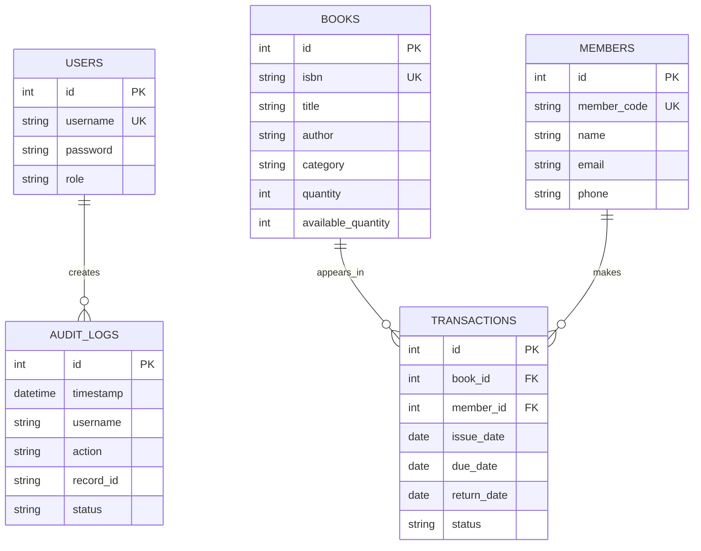

# ER Diagram

```mermaid
erDiagram
    USERS ||--o{ AUDIT_LOGS : creates
    BOOKS ||--o{ TRANSACTIONS : appears_in
    MEMBERS ||--o{ TRANSACTIONS : makes
    USERS {
      int id PK
      string username UK
      string password
      string role
    }
    BOOKS {
      int id PK
      string isbn UK
      string title
      string author
      string category
      int quantity
      int available_quantity
    }
    MEMBERS {
      int id PK
      string member_code UK
      string name
      string email
      string phone
    }
    TRANSACTIONS {
      int id PK
      int book_id FK
      int member_id FK
      date issue_date
      date due_date
      date return_date
      string status
    }
    AUDIT_LOGS {
      int id PK
      datetime timestamp
      string username
      string action
      string record_id
      string status
    }
```
